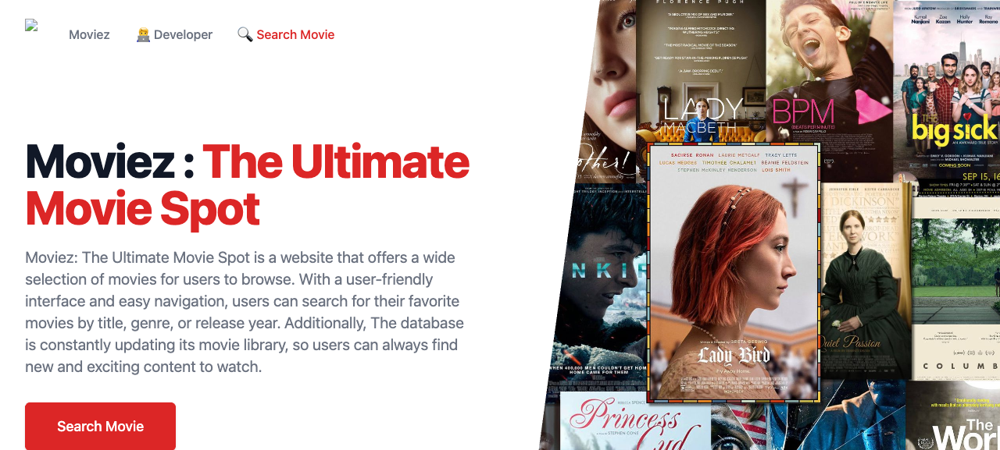

<h1 align="center">Welcome to Moviez 👋</h1>
<p>
  
  <a href="https://twitter.com/buckwheat8848" target="_blank">
    
  </a>
</p>

> Moviez: The Ultimate Movie Spot is a website that offers a wide selection of movies for users to browse. With a user-friendly interface and easy navigation, users can search for their favorite movies by title, genre, or release year. Additionally, The database is constantly updating its movie library, so users can always find new and exciting content to watch.

### 🏠 [Homepage](https://moviez-kafle1.netlify.app/)

### 📸 Screenshot



### 🧑‍💻 Technologies Used

- React, React Router, Tailwind CSS, Recoil, SWR, Axios
- [OMDb API](https://www.omdbapi.com/) for movie data
- Deployed on Netlify

## Getting Started

```sh
npm install
npm run dev
```

## Author

👤 **Niraj**

* Website: https://buckwheat.showwcase.com/
* Twitter: [@buckwheat8848](https://twitter.com/buckwheat8848)
* Github: [@kafle1](https://github.com/kafle1)

## Show your support

Give a ⭐️ if this project helped you!

## 📝 License

Copyright © 2022 [Niraj Kafle](https://github.com/kafle1).<br />
This project is [MIT](LICENSE) licensed.
